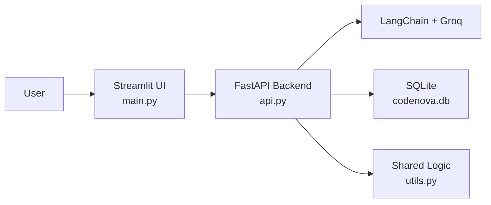

# CodeNova.Devs

CodeNova.Devs is an AI-powered developer suite built with a Streamlit frontend and a FastAPI backend. It combines chat, code-generation tools, debugging helpers, API utilities, generators, snippet storage, PDF export, voice features, and SQLite-backed session history in one project.

## Current Architecture

This repo no longer runs as a single Streamlit-only app. It is split into:

- `main.py` - Streamlit frontend
- `api.py` - FastAPI backend wrapper
- `utils.py` - shared app logic, model calls, DB helpers, exports, and tool functions
- `codenova.db` - SQLite database for sessions, API profiles, and snippets



## Features

- AI chat with Groq-backed models
- Session history with PDF and JSON export
- Voice input and text-to-speech support
- Code tools for explain, translate, refactor, security review, quality review, and debugging
- Dev sandbox for code execution, auto-fix, and time-complexity checks
- API suite for request testing, health monitoring, and saved API profiles
- Generators for unit tests, regex, SQL, Dockerfiles, commit messages, and changelogs
- Snippet library stored in SQLite
- Backend health/reconnect handling in the Streamlit UI
  
## UI / ScreenShots 


## Tech Stack

- Python
- Streamlit
- FastAPI
- LangChain
- Groq
- HTTPX / Requests
- SQLite
- Plotly / NumPy
- gTTS / SpeechRecognition
- FPDF

## Project Structure

```text
CodeNova.Devs/
├── api.py
├── main.py
├── utils.py
├── requirements.txt
├── .env.example
├── render.yaml
├── codenova.db
└── README.md
```

## Local Development

### 1. Clone the repo

```bash
git clone https://github.com/rudra00434/CodeNova.Devs.git
cd CodeNova.Devs
```

### 2. Create and activate a virtual environment

```bash
python -m venv .venv
```

Windows:

```bash
.venv\Scripts\activate
```

macOS / Linux:

```bash
source .venv/bin/activate
```

### 3. Install dependencies

```bash
pip install -r requirements.txt
```

### 4. Configure environment variables

Copy `.env.example` to `.env` and update the values you need.

Minimum required:

```env
GROQ_API_KEY=your_groq_key_here
```

### 5. Start the backend

```bash
uvicorn api:app --reload
```

### 6. Start the frontend

In a second terminal:

```bash
streamlit run main.py
```

### 7. Open the app

- Frontend: `http://127.0.0.1:8501`
- Backend API: `http://127.0.0.1:8000`
- Swagger docs: `http://127.0.0.1:8000/docs`

## Environment Variables

| Variable | Purpose |
| --- | --- |
| `GROQ_API_KEY` | Required on the backend for AI-powered features |
| `CODENOVA_API_BASE_URL` | Explicit backend URL for Streamlit, usually `http://127.0.0.1:8000` locally |
| `CODENOVA_API_HOSTPORT` | Internal Render host/port value used when frontend talks to a private backend |
| `CODENOVA_API_TIMEOUT` | HTTP timeout for frontend-to-backend calls |
| `CODENOVA_API_RETRIES` | Retry count for API requests |
| `CODENOVA_API_RETRY_BACKOFF` | Retry backoff between attempts |
| `CODENOVA_HEALTH_POLL_MS` | Health poll interval when backend recovery is enabled |
| `CODENOVA_HEALTH_AUTO_POLL` | Enables automatic backend health polling |
| `CODENOVA_DB_PATH` | Custom SQLite location for the backend |
| `PORT` | Service port used by deployment platforms such as Render |

## FastAPI API Overview

Major route groups exposed by `api.py`:

- Core: `/`, `/health`, `/meta`
- Sessions: `/sessions`, `/sessions/{session_id}/history`, `/sessions/{session_id}/export.pdf`
- Chat: `/chat`, `/tts`
- Code tools: `/tools/explain`, `/tools/translate`, `/tools/refactor`, `/tools/security`, `/tools/quality`, `/tools/debug`
- Sandbox: `/sandbox/run`, `/sandbox/fix`, `/sandbox/complexity`
- API suite: `/http/request`, `/monitor`, `/api-profiles`
- Generators: `/generate/unit-tests`, `/generate/regex`, `/generate/sql`, `/generate/dockerfile`, `/generate/commit-message`, `/generate/changelog`
- Snippets: `/snippets`

## Deployment on Render

There are two valid deployment patterns now.

### Option A: `render.yaml` (private backend + persistent disk)

The included `render.yaml` is designed for a more complete setup:

- private FastAPI backend
- public Streamlit frontend
- persistent disk for SQLite

This is the better production layout, but it requires Render features that are not available on the free plan.

### Option B: Free Render setup (two public web services)

If you want to stay on the free plan, deploy the services manually:

#### Backend service

- Type: Web Service
- Build command:

```bash
pip install -r requirements.txt
```

- Start command:

```bash
uvicorn api:app --host 0.0.0.0 --port $PORT
```

- Recommended env vars:

```env
GROQ_API_KEY=your_groq_key_here
PYTHON_VERSION=3.11.11
```

#### Frontend service

- Type: Web Service
- Build command:

```bash
pip install -r requirements.txt
```

- Start command:

```bash
streamlit run main.py --server.port $PORT --server.address 0.0.0.0
```

- Recommended env vars:

```env
CODENOVA_API_BASE_URL=https://your-backend-service.onrender.com
PYTHON_VERSION=3.11.11
CODENOVA_API_TIMEOUT=180
CODENOVA_API_RETRIES=0
CODENOVA_HEALTH_AUTO_POLL=false
CODENOVA_HEALTH_POLL_MS=0
```

### Important Render Notes

- Share the frontend URL publicly, not the backend URL.
- On the free plan, services can sleep after inactivity and may need time to wake up.
- SQLite is not persistent on free Render unless you use a persistent disk, so saved sessions/snippets may reset on redeploy or restart.
- For Render health checks, point the backend service to `/health`.

## Dependencies

Current Python dependencies:

- `streamlit`
- `streamlit-lottie`
- `langchain`
- `langchain-core`
- `langchain-groq`
- `fastapi`
- `uvicorn`
- `httpx`
- `requests`
- `python-dotenv`
- `speechrecognition`
- `fpdf`
- `gtts`
- `plotly`
- `numpy`

## Notes

- `main.py` expects a running FastAPI backend.
- If the backend is offline, the Streamlit app falls back to limited metadata mode and API-powered actions will fail until FastAPI is reachable.
- The backend stores app data in SQLite through `utils.py`.

## Maintainer

Built by Rudranil Goswami.
